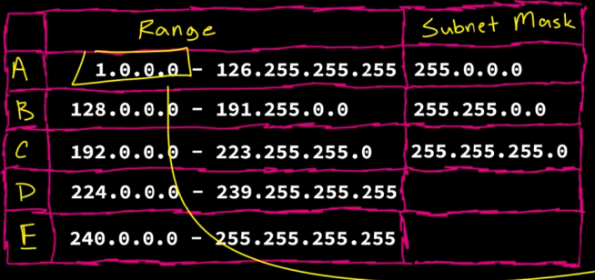

IP:

soooooo, like every house in the world which is accessible through post has an address, every device that can connect to the internet has a IP address, but who give it the address, the router

what is a subnet : it defines what portion of your ip address is the network portion and what portion is the host

lets say for example the subnet is 255.255.255.0
255 : defines that this is part of the network portion
0 : tells the router that you can assign anything from 0 to 255 to the devices in the network

so for the given example 255.255.255.0
                         |network.  |host

why do we have a subnet you may ask

it help my current device to know what devices are there in the current network, if i want to send some information, i wont do some crazy hard work of calling the dns or something, i will see if the destination IP address in in my current network, if yes, i will send it there

okay I get it, but what if the destination IP address is not in your current network, boom you ask your router

example : if your device's IP address is 192.168.1.204
                            subnet is    255.255.255.0

then how many devices or hosts can we have in our network??? yeah from 0-255, total of 256 addresses

but, among the 256 addresses, 2 are locked, Network address(192.168.1.0) and the other is Broadcast address(192.168.1.255)

if you send any data to the broadcast address, it will just broadcast it

apart from these two, one address is for the router(192.168.1.1)

here class d and e are not usable, cause they are alloted for some other stuff

in class A : the subnet is 255.0.0.0, whatttttttt, each network has 256*256*256 hosts, which is about 16 millionnnnnn

there are 126 of these class A network portions as mentioned in the image

similarly for class B, the subnet is 255.255.0.0

but if you observe the image, there is a range of ip's that are missing, the entire 127 class A network, apparantly these are alloted for loopback addressing, these can be used in testing, in our local host machines

Private IP Addresses :

so the issue with IPv4 is that 4.3 billion combinations is not enough, most of it is unusuable, so the solution is private IP addresses

the ip addresses we took in the above example is a private IP address, these are not unique for each device, in a network these are unique, but in two networks, there can be matching private IP addresses

so if it's not unique, how can i connect to the internet, and how am I supposed to receive a API response if there are multiple addesses

boom, the answer is there is a public IP address for your network, the router has it, router allots private IP address to our local machines, whenever you call google.com, your phone or laptop sends that information to your router, your router has a public IP, so it is connected to the internet, so it will be able to receive the response, and then your router knows which device has asked for it, then it sends the response to that particular machine
