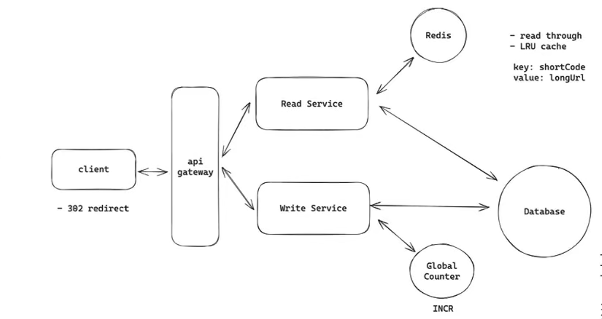

# URL Shortener

Functional Requirements :
    create a short url from a long url
        optionally support custom alias
        optionally support an expiration time
    be redirected to the original url from the short url

Non functional requirements :
    Low latency on redirects(~200ms)
    scale to support 100M daily active users and 1 Billion urls
    Ensure uniqueness of short code
    High availability(here we dont need every user that clicks the short url to be redirected to the page immediately after creation of the url, it does not effect anything important or critical, and if we think logically, for the user to create and share the url there is a delta between the two, so strong consistency is not needed here), eventual consistency

Core entities :
    Original url
    Short url
    User

API :
    shorten the url :
        POST /urls ->shortUrl
        {
            originalUrl,
            alias(optional),
            expirationTime(optional)
        }

    redirect the url :
        GET /shortUrl -> redirect
        there are two types of redirects in https, 301(temporary, no cache in browser), 302(permanent, cache in browser)
        301 : so everytime the url hit will come to our server and redirected, there is not cache in browser for it to directly redirect without hitting our server, this is helpful when we are more considerate about analytics

        302 : url hits are cached in the clients browser, so from the second time the hit wont come to our server, it will be directly redirected, it is useful when we are more considerate about our compute power and we dont do that much analytics

Deep dives :
    how to create short url :
        it should be fast, it should be unique, it should be short(5-7 characters)
        options :
        1. may be we can take the prefix of the long url, but the issue is most websites have the same prefix like (<www.google.com/something> something) if they belong to the same domain, they will have the same short code
        2. random number generator : as our requirement is 10 ^ 9 (1 billion) urls, we need 10 characters
            so we can random generate a number and then do base 62 encode it, if we want 6 characters, to total number of urls we can have with base 62 encoding is 62 ^ 6 = 56 billion, but the issue is even though 56 billion looks like a big number, there is a chance of 880k collisions in every 1 billion generations, but we can just check after every generation if it is present in the db, if already present we can generate again, but this adds extra reads to the db everytime
        3. hash the long url :
            has the long url with something like md5(longUrl) which returns a hash, then you can do base62 encode it and return the first 6 characters of that encoded hash
        4. counter :
            with a counter we can remove the reads to the db, because everytime a url is created, we can increment our counter, so everytime it is unique, then we kind of do base 62 encoding of this counter and return it, but issue is it becomes predictable which is bad for security, we can also have a bijective function( this is a function that return a hash for a number which is unique to every number )

I want my redis to store the key value pair of shortCode to longUrl, and the eviction mechanism should be LRU cache, because this removes the least recently used urls from the cache

for the microservices, i personally think that we can have a single service, because having multiple services like read and write service introduce too much complexity for a really simple system, and we need to handle availability for each service seperately, as write requests or the url shortening requests are very low, like 1rps, i can be handled by a single service, but to handle the read requests or the redirect requests, we need more server instances

sooo, lets go to the metrics
DAU : 100 Million(10 ^ 8) so per second almost we have 10^8/10^5(approximate second in a day 86400) = 10 ^ 3 users per second, if each user makes 10 - 100 requests per second, then the rps is 10k - 100k rps
    a normal ec2 instance can handle 1000rps(it is dependant on the kind of computation power we need on each request and the kind of machine we are working on), so for us we might need 10 to 100 machines, which we can auto configure in aws to auto scale on some metrics

data base : so each row has this information shortUrl(8 bytes), long url(100 bytes), expiration time(8 bytes), creation time(8 bytes), custom url(100 bytes), userid(8 bytes), so the total is max approxiamation of 500 bytes per row, for 1 billion urls it is 500GB, which is normal, so we can have a single data base instance, but what about read throughput, we have the redis to take care of this, most of our reads go to redis, so there is no issue of this as well

counter : this is stored in redis as well, but this needs to be highly available, so we need to kind of configure redis to do this, writing the counter to disc, so that it can keep track of the counter if redis instance goes down
