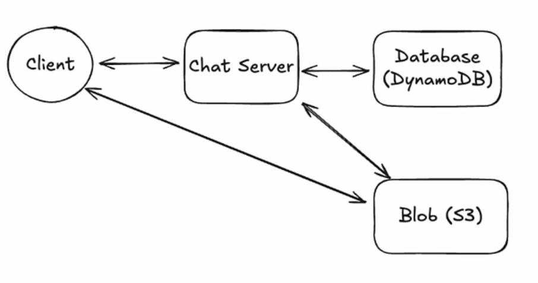
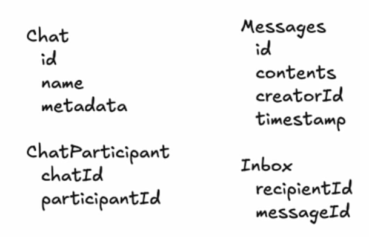

# Whatsapp system design

functional requirements :

1. start group chats
2. send or receive messages
3. send/receive media
4. access messages after I've been offline

Non-functional requirements :

1. low latency < 500ms
2. guarantee delivery of messages
3. billions of users, high throughput
4. messages not stored unnecessarily
5. fault tolerant

Core Entities :

1. Message
2. User
3. Chat
4. clients

Commands Sent :

1. CreateChat
2. sendMessage
3. createAttachment
4. modifyParticipants

Commands Received :

1. newMessage
2. chatUpdate

HLD :

so the basic is there is a client, server and database, clients are connected to server through web socket connection because here we need a two way communication, not only from client to server, but we need to get requests from client and send messages to other clients as well

and then there is kind of a mapping from client id to websocket id

send a message : client sends a message with possible chat id, server loads all the participants of that chat, if a websocket is active against a participant we send the message, if some users are offline we will do something else, that i will explain next

access messages send when offline : so we kind of got to know that the clients that are online when a message is sent, will receive it immediately, but what if the client is offline, so here is where our messages and inbox table comes into picture, so when ever a message is sent from a client to a server, we send all the messages of those participants that are online, and store the information of the offline users information in the inbox table(messageId, receipentId), so when the client comes online, we go to the db and load all the messages against this receipentId, and send those messages

media : for media, we could have a blob storage, and when ever a request comes, we upload the media to the blob, and send this message with same mechanics as a chat message, butttt this is a big red flag, because unlike messages, media could be large, occupying the char server with this much load is not ideal, so what we could do is first we ask the server for a url of where we are dumping this file to, the client gets the message, then client dumps that media to the blob storage directly, then this message is created with the url instead of the actual file, so when the receipent receives this, the media will be downloaded directly from the blob storage, reducing the load on blob, this is how youtube works as well, almost all uploading kind of systems go with this kind of approach

okay lets comes to the interesting part, what if there are multiple servers, and each participant are connected to different nodes, how will my system know who are online and who are offline, so basically we stores something like userId, serverId, socketId in redis, then when the messages comes, we check participants of that chat, check in redis in which server these receipents are connected, use something like redis pub/sub to communicate between servers, send this information to that particular server, that server consumes this data, and sends the message to that receipent

and to deal with messages that are being stored for a long period of time, we can have a cron running that deletes media and messages from db based on timestamps
