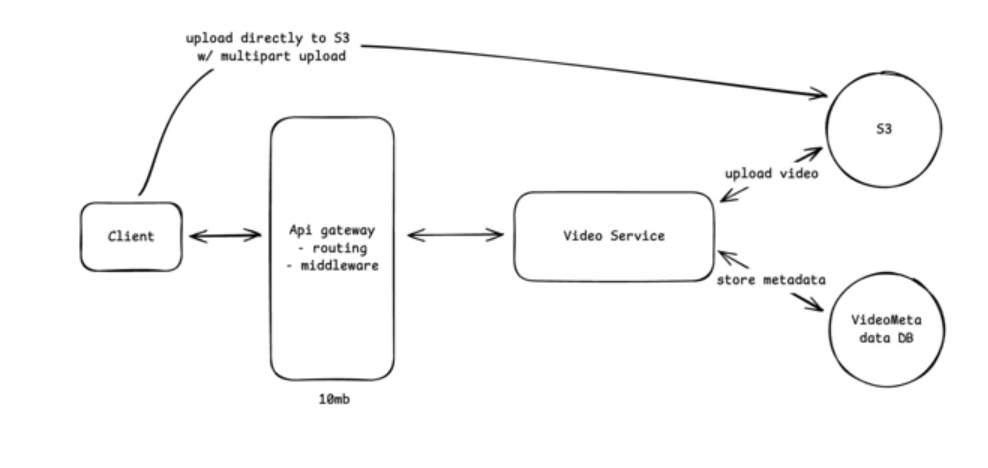
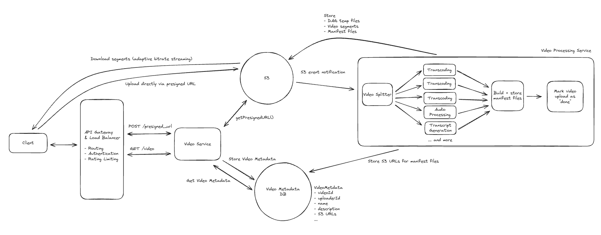

# youtube

Functional requirements :

    1. user should be able to upload videos
    2. users should be able to watch videos

scale :

    1. 1M uploads/day
    2. 100M daily active users
    3. max video size of 256GB

Non functional requirements :

    1. availability > consistency(i dont care if my video is not visible to some users the second i upload, it is okay if they are able to see after some time)
    2. support uploading/streaming for large videos(256gb)
    3. low latency streaming (<500ms)
    4. scalability to scale to 1M uploads/day and 100M DAU

Core entities :

    1. video
    2. video metadata
    3. user

API :

    1. upload video :
        POST /videos
        {
            Video,
            VideoMetadata
        }

    2. watch a video :
        GET /videos/:videoId -> video and metadata

Deep dives :

first thing that is obvious here is the size of the video, generally our components or the components provided by cloud does not accept 256 GB of data from an API call, for example amazons api gateway has a upper limit of 10 MB, so the solution here is to send chunks of data, but instead of sending these chunks through our api gateway and them to our service and then to the object storage like s3, what we can do is, our upload api generates a upload url, through which our browser can directly upload to s3, so this skips the data flow through multiple components

okay upload is okay, what about download ??

consider a video which is 256 gb, i want to watch the video, but it takes and hour to just start the video, it is a nightmare, but similar to what we have done to our upload, we do the same here, chunking, so after we upload our video to our s3, we use the notification functionality of s3, to send notification to a chunking service, whose sole duty is to divide the video into small chunks and upload it to s3

but why duplicate data???? this can be considered a tradeoff here, but it is mandatory here to do that, otherwise the streaming experience of our users will be a nightmare

okay, but how would my browser know this whole information, that i have done above, like the chunking into multiple small videos and storing them, each of them would have different urls, so we store this in our db where we have our video metadata, so the client knows this information, which chunk to call and all

but still consider we have divided the video into a 5s each kind of video, if it is 4k it is still will be a problem when the users network is slow

how would you tackle this???

4k video all the time is not practical, so we divide them based on bitrates, so user uploads a 4k video, or even a 2k video, them our chunker connects with some transcoder, transcodes the chunks into different bitrates like 240p, 360p, 480p and so on and store them in our video metadata table

so the important thing to notice here is that we have to upload all these transcoded videos into s3, and also now our video metadata table has a list of list like

[[240p video chunks ordered][360p video chunks ordered]]

it is a array of array of urls( chunks )

so, now when a user clicks on a video, video metadata will be loaded, then the user knows which urls to call, may be based on the network speed browser can call the specific url, and also if user skips to a later part, them we can calculate which url to call and then call that, istead of loading all the video chunks till that point

now, another issue that comes to our mind is geo location, what if our s3 is in USA, and we are trying to watch youtube in india, every call goes to s3 instance in USA, and returns the data, which could possibly cause some issue, so we can use CDN to minimize this latency

our CDN will have the urls list based on the bitrates, then i knows which video to return when browser calls that url, so instead of storing our urls information in our DB, we can store it in our s3 directly or even in our CDNs

and for the scale part, we will need multiple video service instances, which we can autoconfigure in AWS, and for the remaining though they are mostly from AWS only, so they will take care of the scale

and for the DB data required, we have our one table in our scope of this video, which could be 1kb for a row, and considering 1 million requests per day, and 365 days of the year, it would be .35 TB
